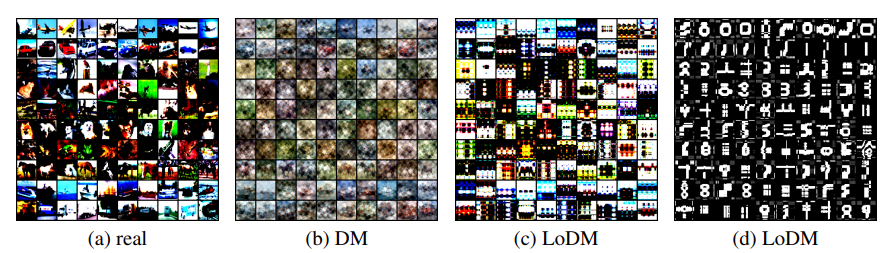

# An-Efficient-Dataset-Condensation-Plugin-NeurIPS-2023

A repository of **'[An Efficient Dataset Condensation Plugin and Its Application to Continual Learning. NeurIPS, 2023](https://openreview.net/pdf?id=Murj6wcjRw)'**.


## Abstract
> Dataset condensation (DC) distills a large real-world dataset into a small synthetic dataset, with the goal of training a network from scratch on the latter that performs similarly to the former. State-of-the-art (SOTA) DC methods have achieved satisfactory results through techniques such as accuracy, gradient, training trajectory, or distribution matching. However, these works all perform matching in the high-dimension pixel spaces, ignoring that natural images are usually locally connected and have lower intrinsic dimensions, resulting in low condensation efficiency.  In this work, we propose a simple-yet-efficient dataset condensation plugin that matches the raw and synthetic datasets in a low-dimensional manifold. Specifically, our plugin condenses raw images into two low-rank matrices instead of parameterized image matrices. Our plugin can be easily incorporated into existing DC methods, thereby containing richer raw dataset information at limited storage costs to improve the downstream applications' performance.  We verify on multiple public datasets that when the proposed plugin is combined with SOTA DC methods, the performance of the network trained on synthetic data is significantly improved compared to traditional DC methods. Moreover, when applying the DC methods as a plugin to continual learning tasks, we observed that our approach effectively mitigates catastrophic forgetting of old tasks under limited memory buffer constraints and avoids the problem of raw data privacy leakage.

<center>

</center>


## Citation
If you find our paper or this resource helpful, please consider cite:
```
@inproceedings{An_Efficient_DC_Plugin_NeurIPS_2023,
    title={An Efficient Dataset Condensation Plugin and Its Application to Continual Learning},
    author={Yang, Enneng and Shen, Li and Wang, Zhenyi and Liu, Tongliang and Guo, Guibing},
    booktitle={Thirty-seventh Conference on Neural Information Processing Systems},
    year={2023}
  }
```
Thanks!

## Code

Our efficient dataset distillation plugin is **easy to implement**. A general implementation framework is as follows:

### Traditional Dataset Condensation (e.g., [DC](https://openreview.net/pdf?id=mSAKhLYLSsl), [DSA](https://proceedings.mlr.press/v139/zhao21a/zhao21a.pdf), [DM](https://arxiv.org/pdf/2110.04181.pdf), [MTT](https://arxiv.org/pdf/2203.11932.pdf), ...)
```
# Step1: Hyper-parameter
num_classes: The number of classes in the dataset, for example, CIFAR10 is 10.    
ipc: The number of condensed images per class, such as 1/10/50.
image size (channel, im_size[0], im_size[1]): The size of the real image, for example CIFAR10, is (3, 32, 32).

# Step2: Initialize synthesis images
image_syn = torch.randn(size=(num_classes*ipc, channel, im_size[0], im_size[1]), dtype=torch.float, requires_grad=True, device=args.device)  
label_syn = torch.tensor([np.ones(ipc)*i for i in range(num_classes)], dtype=torch.long, requires_grad=False, device=args.device).view(-1)
optimizer_img = torch.optim.SGD([image_syn], lr=lr_img, momentum=momentum_img)

# Step3: Get images of c-th class
img_syn = image_syn[c*ipc:(c+1)*args.ipc].reshape((ipc, channel, im_size[0], im_size[1]))

# Step4: Get loss
loss = loss_fun(img_syn) # Gradient Matching / Distribution Matching / Training Trajectories Matching ...

# Step5: Update synthesis images
optimizer_img.zero_grad()
loss.backward()
optimizer_img.step()
```

### Our Efficient Dataset Condensation (e.g., LoDC, LoDSA, LoDM, LoMTT, ...) [paper](https://openreview.net/pdf?id=Murj6wcjRw)

```
# Step1: Hyper-parameter
num_classes: The number of classes in the dataset, for example, CIFAR10 is 10.  
ipc: The number of condensed images per class, such as 1/10/50.
image size (channel, im_size[0], im_size[1]): The size of the real image, for example CIFAR10, is (3, 32, 32).
rank: The size of the rank. (You can set it to 2,4,8, etc.)

# Step2: Reset IPC (same memory cost)
cost_traditional = num_classes * ipc * channel * im_size[0] * im_size[1]
new_ipc = int(cost_traditional / (num_classes * channel * (im_size[0] * rank + rank * im_size[1])) )

# Step3: Initialize synthesis images
image_syn_a = torch.randn(size=(num_classes*new_ipc, channel, im_size[0], rank), dtype=torch.float, requires_grad=True, device=args.device)
image_syn_b = torch.randn(size=(num_classes*new_ipc, channel, rank, im_size[1]), dtype=torch.float, requires_grad=True, device=args.device)
label_syn = torch.tensor([np.ones(new_ipc)*i for i in range(num_classes)], dtype=torch.long, requires_grad=False, device=args.device).view(-1)
optimizer_img = torch.optim.SGD([image_syn_a, image_syn_b], lr=lr_img, momentum=momentum_img)

# Step4: Construction images
image_syn = image_syn_a.matmul(image_syn_b)

# Step5: Get images of c-th class
img_syn = image_syn[c*ipc:(c+1)*ipc].reshape((new_ipc, channel, im_size[0], im_size[1]))

# Step6: Get loss
loss = loss_fun(img_syn) # Gradient Matching / Distribution Matching / Training Trajectories Matching ...

# Step7: Update synthesis images
optimizer_img.zero_grad()
loss.backward()
optimizer_img.step()
```

> Tips: Some of the hyperparameter configurations in our experiment results can be found in the './cofigs/xxx/README.md' directory.
In most cases, we default to rank r=2, and the other hyperparameters are the same as the baseline.

## Run

Run [DC](https://openreview.net/pdf?id=mSAKhLYLSsl)
> python main_DC.py

Run [DM](https://arxiv.org/pdf/2110.04181.pdf)
> python main_DM.py

Run [MTT](https://arxiv.org/pdf/2203.11932.pdf)
> python buffer.py <br>
> python main_MTT.py

Run Our [LoDC](https://openreview.net/pdf?id=Murj6wcjRw)
> python main_LoDC.py

Run Our [LoDM](https://openreview.net/pdf?id=Murj6wcjRw)
> python main_LoDM.py

Run Our [LoMTT](https://openreview.net/pdf?id=Murj6wcjRw)
> python buffer.py <br>
> python main_LoMTT.py


## Acknowledgement
Our implementation references the code below, thanks to them.

[VICO-UoE/DatasetCondensation](https://github.com/VICO-UoE/DatasetCondensation),
[georgecazenavette/mtt-distillation](https://github.com/georgecazenavette/mtt-distillation)
